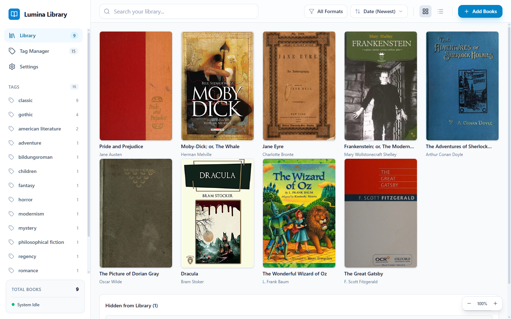
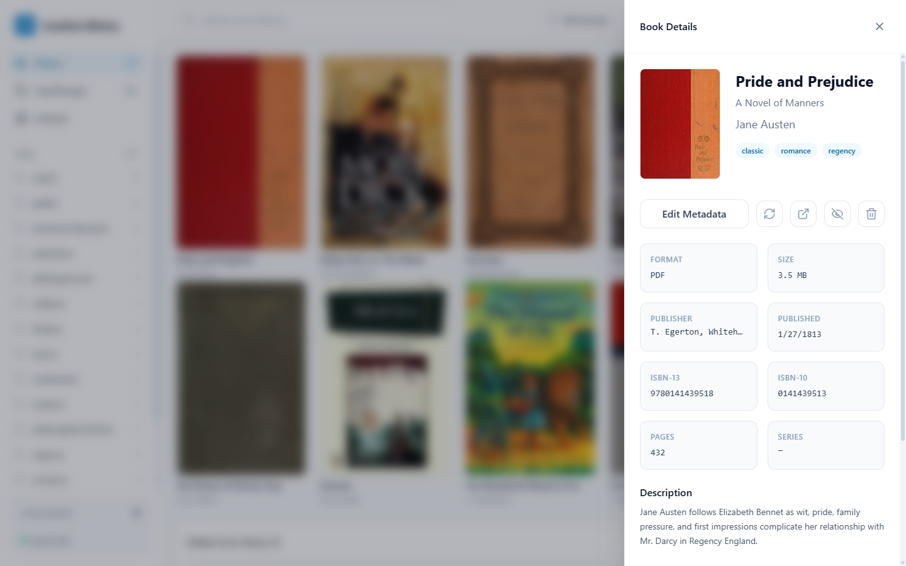
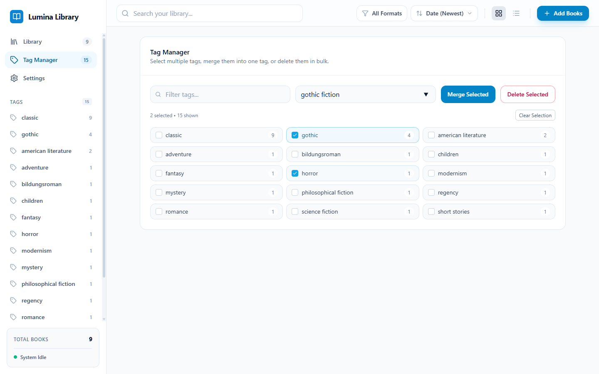
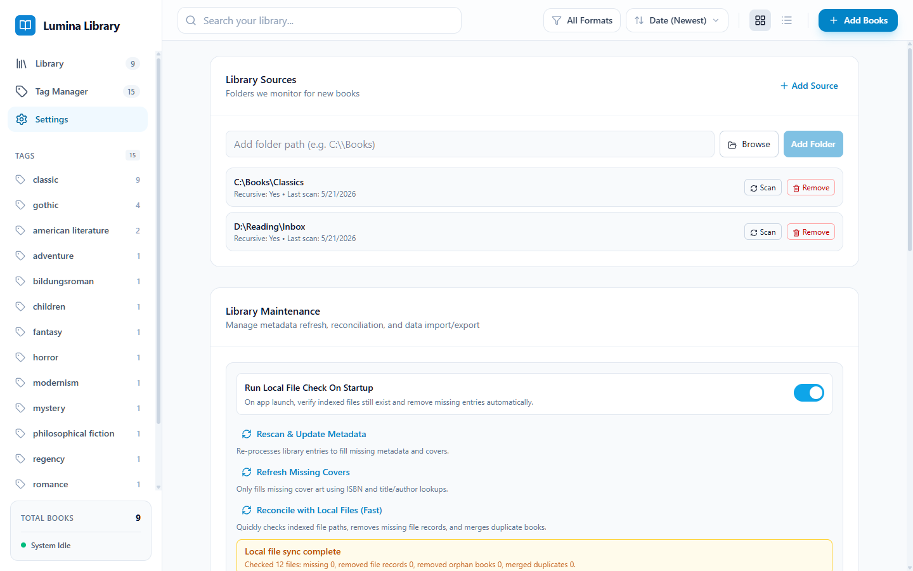
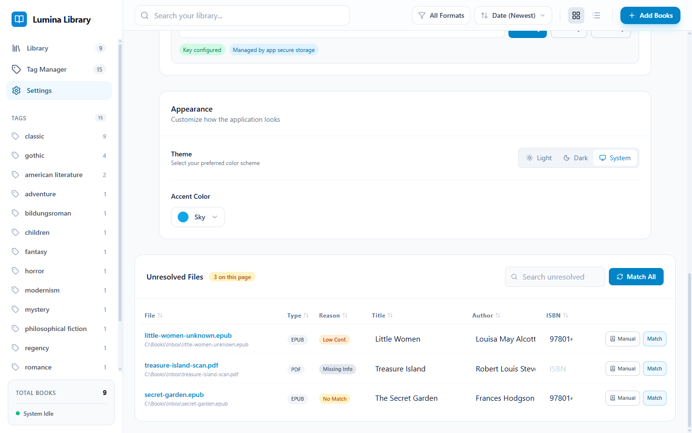
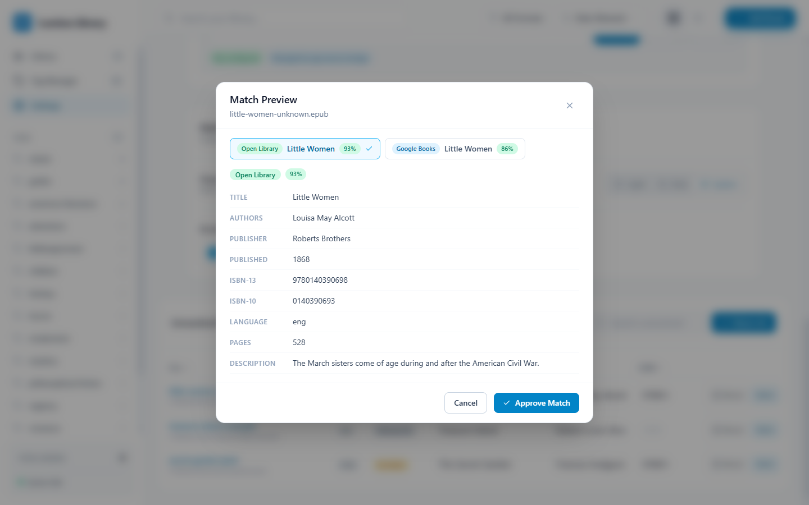

# Lumina Library

Lumina Library is a local-first Windows desktop app for cataloging PDF and EPUB books. It watches the folders you choose, extracts embedded file metadata, enriches records through public book catalogs, and gives you a searchable personal library without moving or uploading your files.

The app is built for large local collections: books stay linked to their original file paths, metadata can be curated manually, unresolved files are kept in a review queue, and SQLite FTS5 powers fast title, author, tag, and metadata search.

## Feature Tour

### Browse and Search Your Library

The main library view displays matched books as a cover grid or compact list. Search, sort, format filters, tag filters, and cover zoom are always available from the primary workspace, while the sidebar keeps high-value tag filters close at hand.



### Review and Curate Book Metadata

Open any book to inspect and edit its catalog record without leaving the library. The details drawer keeps cover art, title, subtitle, authors, tags, source files, format, publisher, publication date, ISBNs, page count, series, and description together. From the same panel you can refresh metadata, open the local file, reveal the containing folder, hide the book, or remove the indexed record without deleting files on disk.



### Manage Tags in Bulk

The tag manager supports filtering, selecting multiple tags, merging variants into a canonical tag, and deleting tags across affected books. This is useful after importing a large folder where filenames, embedded metadata, and manual edits may have produced near-duplicate tag names.



### Configure Sources and Maintenance

Settings provide source-folder management, one-off folder scans, startup file reconciliation, missing metadata rescans, missing cover refreshes, CSV import/export, Google Books API key testing, and appearance controls. App-managed API keys are stored in the OS credential manager instead of the SQLite library database.



### Resolve Low-Confidence Matches

Files that cannot be matched confidently are kept in an unresolved queue instead of being discarded. You can adjust guessed title, author, and ISBN fields, retry matching all unresolved files, create a manual book record, or preview candidate matches before accepting one.



### Preview Enrichment Candidates

Match previews show candidate metadata from enrichment providers such as Open Library and Google Books, including confidence scores and key fields. This makes it clear what will be applied before a low-confidence file becomes a library book.



## Features

- Add one or more local library folders and scan them recursively for PDF and EPUB files.
- Parse embedded metadata, file names, and ISBN candidates during indexing.
- Enrich book records with Open Library metadata and optional Google Books cover lookup.
- Auto-match high-confidence results while keeping uncertain files in an unresolved review queue.
- Search, sort, and filter the full library by text, format, tag, author, folder, and status.
- Switch between cover grid and compact list views, with adjustable cover zoom.
- Open a book details panel to edit title, subtitle, authors, publisher, dates, ISBNs, description, series, tags, covers, and linked local files.
- Rescan a book and selectively apply curated metadata updates.
- Hide books from the main library without deleting local files, then restore them later.
- Manage tags, including merging duplicate tags and deleting tags across affected books.
- Export unresolved files to CSV, enrich them outside the app, and import updates back into Lumina.
- Reconcile indexed records with the local filesystem to detect missing files, remove stale entries, and merge duplicates.
- Store optional Google Books API keys in the OS credential manager instead of the app database.

## Metadata Enrichment

Lumina first indexes what exists locally: file path, file type, size, embedded title/author data, and any ISBN-like identifiers it can detect. It then uses those lookup keys to search external book data sources:

- Open Library is used for public catalog metadata and cover discovery.
- Google Books can be enabled with an optional API key to improve cover and edition lookup reliability.
- High-confidence matches are added automatically.
- Ambiguous or incomplete matches stay in the unresolved queue for review.
- Manual edits and curated metadata can be applied later from the book details drawer.

## App Workflow

1. Add a source folder from `Settings -> Library Sources` or the `Add Books` button.
2. Lumina scans supported files, records file paths, extracts metadata, and tries to enrich each item.
3. Matched books appear in the main library. Uncertain files remain in the unresolved queue for manual matching or CSV export.
4. Use the details panel to curate metadata, update tags, refresh covers, open local files, or hide books from the visible library.
5. Use maintenance actions to rescan missing metadata, refresh missing covers, or reconcile the index with files on disk.

## Stack

- Tauri 2 desktop shell with a Rust backend
- React, TypeScript, and Vite frontend
- SQLite database with FTS5 search
- Tailwind CSS v4 and Motion UI animation
- TanStack Query and Zustand for client state

## Development

Prerequisites:

- Node.js 25 or newer
- pnpm 11.2.2
- Rust 1.95.0 or newer
- Windows development environment for Tauri desktop builds

```bash
pnpm install
pnpm tauri:dev
```

Optional: set `GOOGLE_BOOKS_API_KEY` in your environment to improve cover lookup reliability when Open Library has no cover image. You can also set, test, or clear this key in `Settings -> Integrations`; Lumina stores app-managed keys in your OS credential manager.

Optional: set `BRAVE_SEARCH_API_KEY` in your environment to enable embedded web image results in the cover picker. You can also manage this key in `Settings -> Integrations`.

## Build

```bash
pnpm build
pnpm tauri:build
```

`tauri:build` produces Windows installer output through the configured NSIS target.

## Test

```bash
pnpm test
```

## License

MIT. See `LICENSE`.
